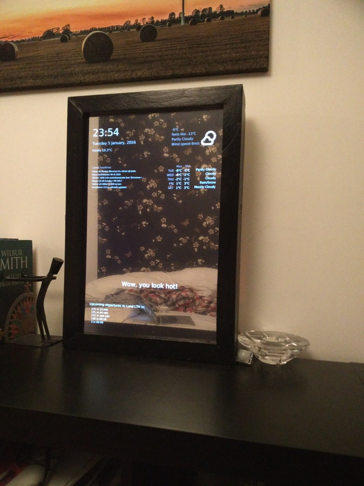

Pi MagicMirror
=======
An application to display a GUI behind a observation mirror on an Raspberry Pi. Note: this is an early version, as it might break for other settings than mine.

## Info
At the moment it supports PIR motion detector and DS18B20 temperature sensor.
It displays upcoming buses for some location in Skåne with Skånetrafiken. 
News are pulled from Yahoo News and Weather also from Yahoo.

New is voice recognition, which I currently use to control my Philips Hue lights.

## Plans
- Voice controlling more than lights.
- Outside temperature using some small microprocessor and radio transmitter.

## Installation
TBA

[Ds18b20 temperature sensor installation](https://learn.adafruit.com/adafruits-raspberry-pi-lesson-11-ds18b20-temperature-sensing/hardware)

[PIR motion sensor of this type](https://learn.adafruit.com/pir-passive-infrared-proximity-motion-sensor)

[Voice recognition with Pocketsphinx](https://github.com/cmusphinx/pocketsphinx)

##Licence
[Licence](http://www.apache.org/licenses/LICENSE-2.0)
